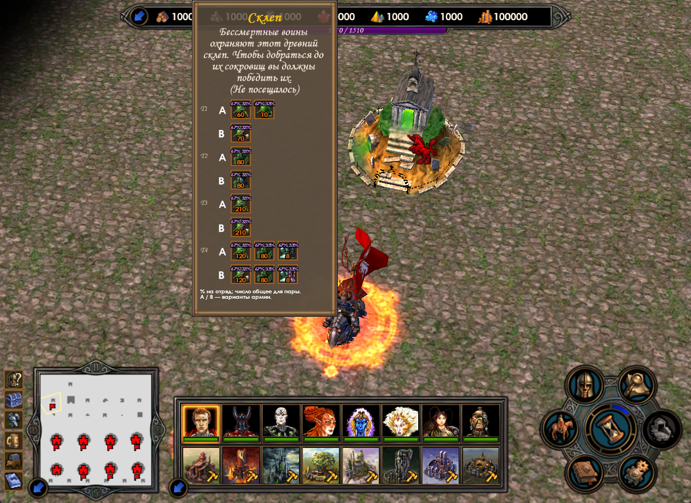

# Bank reference

The mod shows **possible armies by tier**, portraits, ranges and alternatives. It does not reveal an object's actual hidden guards.

## Download and install

**The DLL package is not published yet.** The separate-EXE candidate was withdrawn. Keep launching through Heroes/Lobby as usual. Code → Download ZIP downloads source code, not the player package.

[Mod on GitHub](https://github.com/Xaaalera/heroes5-bank-reference) · [Universe](https://h5lobby.com/).

The player ZIP needs Windows and the [supported game build](../reference/universe-build.md). No Python, Git or devkit is needed.

1. Exit the game and editor. The DLL package contains the shared `bin/dinput8.dll`, `bin/Heroes5Mods/WorkshopBankReference.dll` and `UserMODs/workshop-army-reference.h5u` for the installed game directory.
2. Both of our mods share one `dinput8.dll`. Do not replace a copy belonging to another mod; that combination has not been checked.
3. Start through Heroes/Lobby as usual. There is no separate player EXE for this mod.
4. Hover a supported bank on the map: the possible-army reference should appear.

Remove the old text prototype `workshop-object-reference.h5u` from UserMODs if present: it adds unwanted text and stretches the card. Preserve an existing H5U separately before replacing it. The reference DLL and H5U must belong to the same release. This delivery is under validation; its public download will be added afterward.

## Disable and remove

Exit the game. Remove `UserMODs/workshop-army-reference.h5u` and `bin/Heroes5Mods/WorkshopBankReference.dll`. Leave other UserMODs files alone. Remove shared `bin/dinput8.dll` only after removing all of our DLL mods, and only if it came from our package.

[Developers: source build and test environment](../modding/devkit.md#mod-sources).

## Use the mod

On the adventure map, hover a supported bank to display its possible guard armies.

## Read the reference

Crypt card after removing the old text prototype. A and B are alternatives for one tier, not parts of a single army.

- T1/T2… describes a possible tier, not scouted guards of this object.
- A/B separates alternative complete armies; do not sum them.
- Split portraits show substitutable species. A percentage applies per stack.
- The paired count is the whole group's range, not a guaranteed count of each species.

[Where tiers and ranges come from](../reference/banks.md). Thirteen families map 19 public titles to 12 confirmed types. OrcDeposit remains unbound; renamed objects are unsupported by title-based selection.

## Example: imp cache

Public imp-cache data gives these reference ranges by tier:

| Tier | Range |
|---|---|
| T1 | 90–135 |
| T2 | 120–165 |
| T3 | 150–195 |
| T4 | 180–225 |

The T2 range belongs only to that variant: do not add other tiers or infer that the selected bank actually has T2. [Calculation source](../reference/research-diary.md#banks).

## Limits

Historical evidence covers the imp cache. On September 25, automatic DLL loading displayed the crypt card at 1264×921. Both DLLs were active together, including five predictor battle cycles. Other banks, display sizes and all feature combinations remain incompletely checked.

