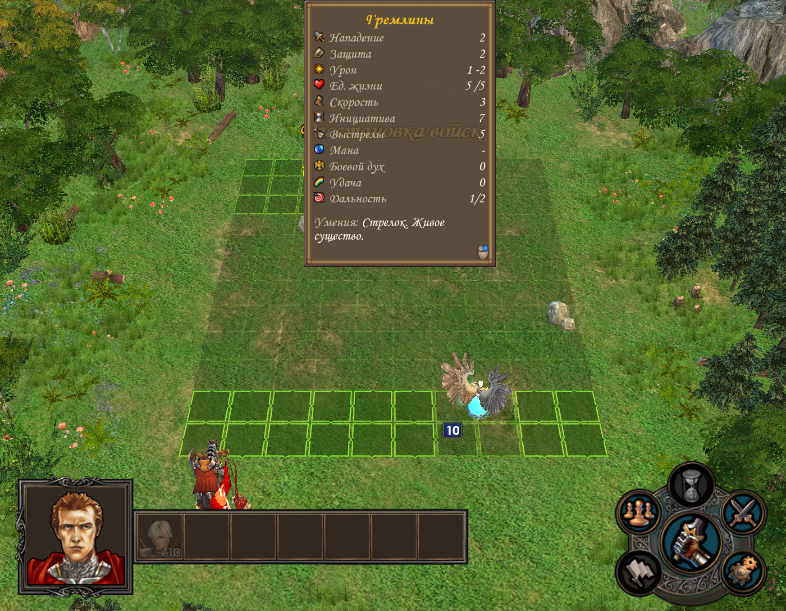
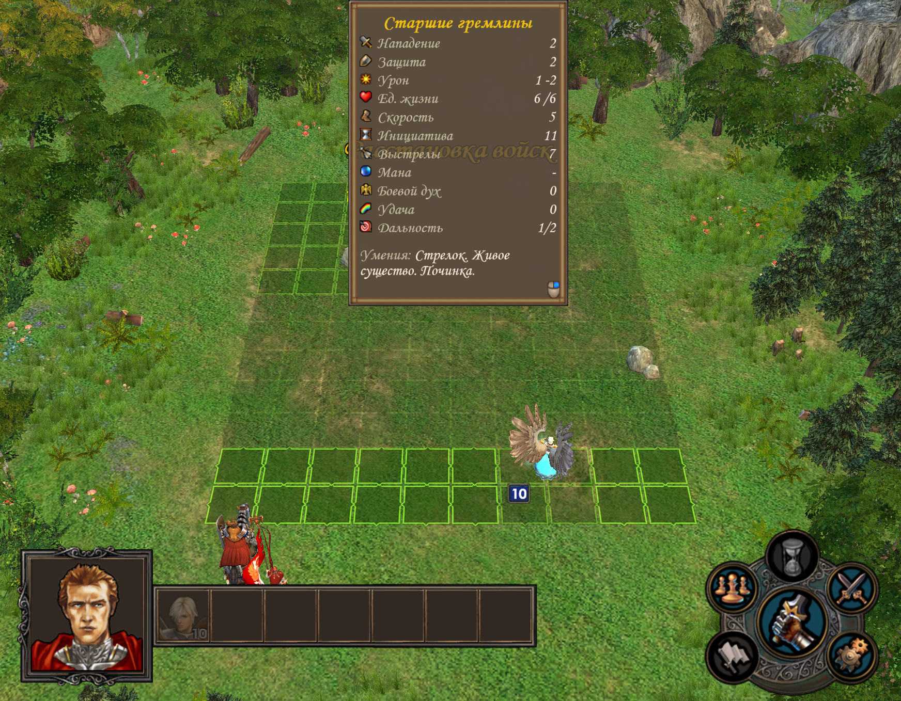

# Deployment predictor

A projection marks **a creature's predicted position and movement area**. It uses a known type without revealing hidden guard quantities or upgrades. This is an experimental mod for the inspected Universe build; no universal release is available.

## Development status

The previous research Superadmin build completed independent verification after pass-transition and runic corrections: **273/273 battles, 757 stacks, ten map runs and 16,830 numerical values**. Forecasts were retained before Start and compared with the complete actual roster afterwards. Different armies and heroes were used, but every observed hero level was one. That result belongs to that build. [Campaign coverage and verification limits](../reference/research-diary.md#placement-runic-matrix).

The current working SDK build already has two independent calculations: the visible approximate forecast and a hidden full calculation for verification and explanations. Ordinary prediction retains available numeric ranges. In tested ordinary guards, Scouting or an equipped Crown of Many Eyes admits the exact original composition; completed combat splitting and hidden upgrades do not enter the forecast. Quick Battle result integration remains planned.

After Start, the **«Расстановка» (Deployment)** button opens one schematic field: blue forecast, orange facts and green hero army. Select a stack to see its placement phase, rule, footprint and rows. An explanation comes from the full calculation only after the entire pack matches the facts; otherwise the reason is marked unconfirmed. Without a prior forecast, the window shows actual deployment. The **«Считать типы нейтралов известными для прогноза» (Treat neutral types as known for prediction)** checkbox applies to subsequent encounters in this game session and preserves the current forecast.

This branch corrects dense-spread priorities and quantity-label identity. Retained-field replay and two fresh 7/7 full-calculation controls are available, but the current version has no broad acceptance yet. **These features are not in the downloadable package below.** [New-branch verification](../reference/research-diary.md#placement-dense-spread).

Player-package readiness requires separate interface checks and ordinary Heroes/Lobby startup without an installed SDK. The research result does not certify the accuracy of the downloadable package below. Maximum variation of armies, levels, skills, artifacts and arenas is recorded in the future plan.

SDK checks cover projections before Start, footprint and movement highlighting, creature cards, selection of a reference upgrade and opening the full description. Description navigation arrows remain unverified. These changes have not shipped in the player package. [Interface-verification stages](../reference/research-diary.md#placement-sdk-capture).

## Download and install

**[Download DLL package 0.1.0-preview.2](https://github.com/Xaaalera/heroes5-deployment-preview/releases/download/v0.1.0-preview.2/Heroes5DeploymentPreview-0.1.0-preview.2.zip)** — experimental release. Keep ordinary Heroes/Lobby startup; there is no separate mod EXE. Code → Download ZIP downloads source, not the player package.

[Mod on GitHub](https://github.com/Xaaalera/heroes5-deployment-preview) · [Universe](https://h5lobby.com/).

The player ZIP needs Windows and the supported game. No Python, Git or compiler is needed.

1. Exit the game.
2. Both of our mods share one `dinput8.dll`. Do not overwrite a copy installed by another mod; that combination has not been checked.
3. Extract the ZIP. Copy `bin/Heroes5Mods/WorkshopDeploymentPreview.dll` into the matching folder of the installed game; create `Heroes5Mods` inside `bin` if needed. If our shared loader is not installed yet, copy the package's `bin/dinput8.dll` into the game's `bin`. Retain an already installed shared loader.
4. Start through Heroes/Lobby as usual. There is no separate player EXE for this mod.
5. Start an ordinary battle: enemy projections should appear before Start. Hover for movement range; right-click for a creature card.

If the build is unsupported, compare it with the linked build below. Original `d3d9.dll`, `uni.dll` and `um.dll` are not replaced. Validation results and limits are described below.

## Disable and remove

Exit the game and remove `bin/Heroes5Mods/WorkshopDeploymentPreview.dll`. Remove the shared `bin/dinput8.dll` only after removing all of our DLL mods, and only if it came from our package. The predictor installs nothing in `UserMODs`.

[Developers: source build and test environment](../modding/devkit.md#mod-sources).

## Compatibility

Developed for the [inspected Universe build](../reference/universe-build.md). Both mod DLLs loaded together through five battle cycles with cards and cleanup. This does not cover every combination; other game versions are unverified.

## Controls

| Action | Result |
|---|---|
| Hover | Movement area of the selected reference type |
| First RMB | Full card of the base or already known upgrade |
| Repeated RMB when upgrade is unknown | Base → upgrade → alternative upgrade → base |
| Double LMB | Native detailed creature window |
| Detailed-window arrows | Switch available variants |
| Start | Remove projections, cards and highlighting |

If the upgrade is known, the card shows it. Figures are opaque with a subtle warm glow. The current version has no additional lower arrows.

## Example: gremlin and upgrade

Switching changes speed from **3 to 5** and health from **5 to 6**. The movement area is recalculated with the card.

Stats are not hardcoded for the pictured creatures. `Speed`, `Flying` and `CombatSize` come from the [selected type definition](../reference/creatures.md); the native descriptor supplies the name and card fields. The cache key includes the type, preventing reuse of the previous upgrade's movement area.

## Why the detailed window shows “1”

The reference contains one creature without a hero or real combat stack. This **does not mean the guard has one enemy**. The card also does not establish effects that apply in an actual battle.

## When prediction and battle differ

September25 checks found errors in strategy selection, spread and stack ordering. The local DLL now attempts protective placement, but generator packs remain unstable: one ordinary RMG-A pass matched every cell in9 of18 mixed battles. The downloadable preview.2 does not contain these local corrections. A solo split is a separate explained miss; upgrades do not penalize the cell comparison. [Evidence and limits](../reference/research-diary.md#rmg-placement-check).

The prototype assumes one stack per publicly known type. The game can split it, change the composition or choose a special strategy.

In one observed example, a single peasant projection before Start became **three combat stacks of 10**. Splitting explains the mismatch, not cell size. [How the game builds the army](army-placement.md).

**Checks on September 21–23, 2026:** the user confirmed opening and cycling with physical RMB. Holding RMB remains unconfirmed; background window messages do not replace that check. The prediction does not read hidden quantities, final upgrades or the completed combat army as inputs.

[Research record](../reference/research-diary.md#projection-range).

The September 25 DLL-loading check matched **1 of 7 positions** in a mixed pack, and one single-stack prediction became two stacks. Successful mod startup does not imply accurate placement. [Data from this run](../../assets/preview/dll-checks-2026-09-25.json).
