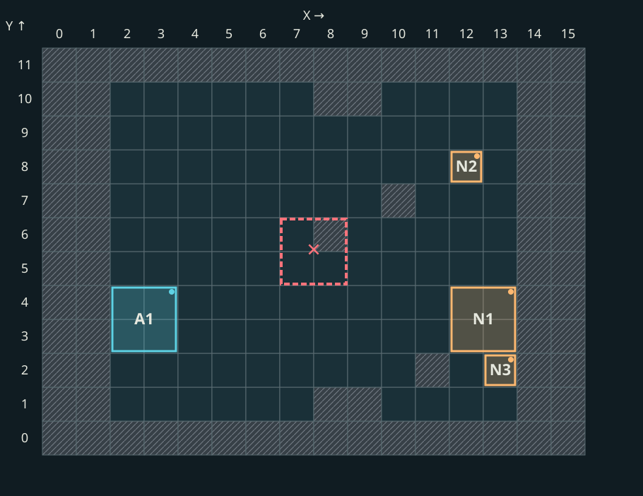

# Placement internals and corrected assumptions

Technical reference for **stack splitting, sorting and cell selection**. Start with the illustrated [player explanation](../players/army-placement.md). The inspected mechanisms belong to the [pinned EXE](universe-build.md); validation scope is listed at the end.

## Research checkpoint {#current-research}

As of **8 October 2026**, the research predictor is preserved and algorithm work is paused. The new mechanisms have not shipped in the player package.

The prototype freezes the complete prediction **before Start**, then compares it with the actual army after battle starts. A complete match requires the same **creature, quantity and cell for every stack**. Matching occupied cells alone is a separate, weaker measure.

### Additions and corrections

- Separated defensive placement, general placement and linked groups. Goblins and their carriers require adjacency checks that account for creature footprints and occupied cells.
- Corrected shooter classification: placement uses declared shots and the “Cyclops + Goblin” group condition. Physical creature state is checked separately. This defect preserved the army composition but misplaced all three stacks in a control battle.
- After partially successful simple placement, preserve selected cells and exact quantities of placed source records. Repeated stacks of the same creature retain their identity; reducing the record count must not recalculate successful positions.
- Investigated parts of army valuation, hero specializations and the initial placement area. Isolated arithmetic checks do not establish every combination of effects and modes.

### Latest tested research DLL

The last completed checks before the pause ran on **4 October**, after correcting source shooter classification:

| Check | Result | Verified scope |
|---|---|---|
| Isolated native tests | 60/60 | Local rules and regressions; not a battle campaign |
| Cyclops, Goblin and Archer counterexample | 3/3 stacks | Creature, quantity and cell in one battle |
| Full test polygon with 100 Archers in the hero army | 36/36 battles | 30 mixed and 6 single-type packs |
| Ten-load campaign | Incomplete | Two loads and three battles of the third, then the game was closed to change priorities |

The preceding DLL achieved **151/151 complete matches** across five loads: 108 polygon battles and 43 random-map battles. An earlier version separately achieved **273/273** across ten loads. Each result belongs to its own build and cannot certify a changed DLL. Later counterexamples showed that a successful campaign does not establish the complete algorithm.

The early **111/149** measured occupied-cell matches; **14/14** were native tests from an early stage. Neither describes current progress or equals complete-army accuracy.

### Remaining work

- Complete a fresh broad campaign for the latest DLL and cover other hero armies, obstacles and field shapes.
- Resolve remaining transitions between passes, threshold ties, effects, random branches and crowded compositions.
- Decide ordinary-mode inputs separately: hidden counts, upgrades and the final neutral split must not become inputs to ordinary prediction.
- Add post-Start explanations for every player: why the army took its actual positions and how they differ from the prediction.

The target is complete agreement for every pack in research Superadmin mode. It **has not been achieved**. Earlier rules and their limits remain below; the [diary](research-diary.md#placement-checkpoint) records this checkpoint.

## Army preparation

The combat-army preparation function builds records before placement. Its inspected multiple-source-record branch copies types/counts; one record enters splitting. Earlier composition changes remain possible.

For normally loaded CombatSize 1/2, M=4. The tested property is CombatSize, not tier; the loader clamps it to1…2, so the CombatSize>2 branch selecting M=2 is unreachable for those values.

| Strength ratio R | Initial K when M=4 |
|---|---:|
| R<0.5 | 4 |
| 0.5≤R<1 | 3 |
| R≥1 | 2 |

RNG(1,100) results≤30 decrement K; results≥70 increment it when K<M. Then clamp K to1…N. These are code comparisons, not verified RNG percentages. With K>2 and Upgrades, another test strictly<50 can substitute interior-stack types; endpoints keep the original. Divide N by K with remainder: first r stacks get q+1, others q. Ten into three gives 4/3/3.

Splitting strength differs from placement score. For the inspected CHero path, numerator evaluates its army with hero context, denominator evaluates the opposing vector without a hero. An extra getter context is week type; WEEK_OF_TOUGHNESS uses H+H div 5. This is static tracing, not coverage of every Universe week/interface implementation.

## Entry paths

The automatic-placement entry checks combat_active_auto_placement and nonempty source descriptors. For ordinary CAdvMapMonster the chain reaches the map object's army, not unique portrait count. The placement-completion entry preserves existing positions and fills gaps.

The extended path controls retries, builds a placement context, then selects the formation. Formation selection conditionally runs the defensive pass, always runs the general pass, then tries remaining stacks by column. The simple path has its own fallback.

In the pinned Universe `DefaultStats.xdb`, the defensive comparison uses `OurShootersMinRelativePower=0.2` and `OurShootersMinRelativeAdvantage=1.3`, both with strict greater-than tests. An opposing-capability check and early conditions also apply; the two thresholds are not the complete formula. Spread is related to `EnemyAreaAttackMinRelativePower=0.35` and its own conditions. Defence and spread can both be enabled. Two recorded `pack_15` battles with the same captured public quantity bands had shooter-power shares of about 0.217 and 0.183 with different defensive flags; exact neutral counts were not retained and arenas differed. [Observation record](research-diary.md#placement-defence-2026-09-26).

The defensive candidate-selection function lists free neighbors of occupied cells, removes duplicates, and sorts candidates. The shooter-window row scorer assigns weight 2 to chosen shooter-window rows, 1 to their neighbors, and 0 to other rows; the candidate-order comparators resolve ties in the game's order. Large and small defenders keep separate candidate sequences, and an entire 2×2 footprint is checked before placement. Combined defence and spread use selected spaced rows rather than ordinary adjacency. At an early stage, recorded Polygon `pack_15` attempts from rounds 1, 4, and 10 passed offline when the defensive branch was supplied. Subsequent live research-DLL checks and their limits are listed in the current checkpoint above.

## Scores and ties

Placement scoring uses a synthetic one-peasant reference without a hero, not the player's army. The aggregate-construction function uses:

```text
D = truncate(((minDamage + maxDamage) * N) / 2)
H = healthPerCreature * N
```

Multiply before division: damage 1–2 at N=3 gives 4, not 3. Attack is weighted by integer damage, defence by health. The scorer reads a separate reference-defence parameter, which this chain leaves zero; it does not read the ordinary defence field. Final scores/fractional reference parameters truncate toward zero.

The arithmetic control used DamageIncrease/Decrease 0.05. Adjacent cap fields 3/0.1 are not read by the placement scorer; do not import them based on neighboring names. This is not the damage-dealt formula.

The ordinary numeric-sort function merges decreasing-stride lanes; ties take the right lane. Ten equal rows produce 8,4,6,10,2,7,3,5,9,1. All 3280 sequences of length 0…7 over{0,1,2} matched original numeric-sort instructions; that does not test getter-dependent comparators.

The special placement comparator orders stacks as follows: non-flying before flying; speed when max(speed 1,speed 2)≥distance; then score. General-pass distance=width−deploymentColumns−6. The [executable walkthrough](../../assets/placement/placement_walkthrough.py) covers one confirmed case, not every branch.

## Rows, spread and depth

The approach-length calculation supplies the shooter-window selector, which retains the first minimum-sum window. The spread-row selector uses integer division(R−1)/(N−1), then adds 0.001. Truncate i×step for the first N−1 indices; append R−1. R10,N3 gives{0,4,9}, not{0,5,9}. Preserve original candidate order; occupancy filtering falls back to the prior list if empty.

Large units reserve all 2×2 cells. The large-footprint mask builder derives anchor restrictions from a copy, avoiding recursive propagation.

[](../../assets/placement/pack_8-footprint.svg)

The deployment-depth function calculates the number of placement columns inside the field. The observed Universe patch changes the large-position threshold 2L→3L and adds a column at L≥4. Minimum 2/3 depends on effective Tactics advantage; equal effective opportunities clear both flags. The extra blocking predicate is not conclusively mapped to a named specialization.

## Linked groups and retries

Goblins and their users have a separate adjacency-selection function. Candidate scoring considers membership in multiple lists; the choice is greedy, not globally optimal.

The shooter-support adjacency function uses world coordinates in a local-coordinate filter. An empty local 3×10 zone yielded no candidates for world anchor(13,5), but neighbors for(2,5). Guaranteed shooter adjacency is not established.

The apparent same-type merging function has an unreachable inner loop for valid vector sizes; tested N0,1,2,3,7,64. Window shifts/retries exist, but a branch name does not establish working merging. Excluding a record from an attempt does not prove creatures disappear from the map army.

The additional-ability evaluator has separate applicability/target tests. In the inspected call, contribution=min(uses,10)×value div 10; EXPLOSION 162 and DEATH_WAIL316 are excluded. Initial-value semantics/all predicates remain incomplete; not a complete ranged-damage formula.

## Evidence scope

Sort/truncation/footprint and parts of split/spread arithmetic ran in original-code emulation. Universe width changes were observed in a separate process. The live elemental journal confirms seven attempts/four cells only for its ordinary pass. It does not validate every special mode.

**Evidence:** September 21–23 analysis and corrections; published [example data](../players/army-placement.md). [Definitions](creatures.md) · [Research map](research-index.md).

[Research record](research-diary.md#placement-corrections).
