# Как игра расставляет нейтральную армию

**Игра размещает отряды по очереди: выбирает подходящие ряды, проверяет свободные клетки и резервирует занятое место.** Поэтому препятствия и уже поставленные существа влияют на следующий отряд. Перед этим игра готовит состав армии и выбирает способ построения.

Разберём правила на полных 2D-схемах, затем проследим семь попыток размещения четырёх элементалей. Примеры относятся к **Heroes V: Повелители Орды с Universe**; [источники и границы проверки](#evidence) приведены в конце.

## Как читать 2D-схемы

[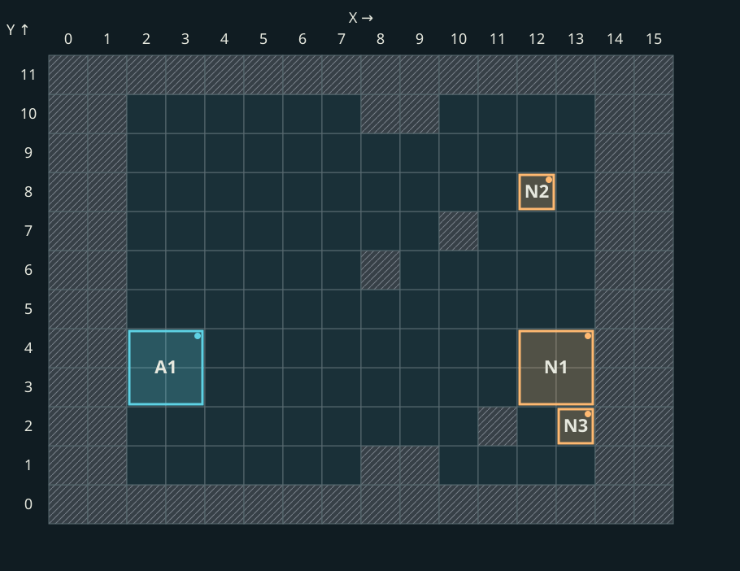](../assets/placement/pack_8-positions.svg)

**X — номер колонки**, увеличивается вправо. **Y — номер ряда**, на схемах увеличивается вверх. Это координаты игровой сетки, а не пиксели экрана. Камера может смотреть под другим углом — координаты от этого не меняются.

- Голубые квадраты **A** — отряды армии героя; оранжевые **N** — нейтралы. Номер отличает отряды; это не их численность или очередь хода.
- Штриховка — заблокированные клетки: препятствия и внешняя служебная рамка. Для этих опытов полная сетка 16×12; крайние служебные клетки не являются местами для отрядов.
- Цветная точка показывает якорь `(x,y)`. У крупного существа на этой схеме это верхняя правая клетка квадрата 2×2; весь квадрат занят одним отрядом.
- Например, **A1 — ангелы героя, якорь `(3,4)`**: заняты `(2,3)`, `(3,3)`, `(2,4)`, `(3,4)`. **N1 — джинны, якорь `(13,4)`**: заняты колонки 12–13 и ряды 3–4.

На схемах показаны обе армии и препятствия. Нажми на изображение, чтобы рассмотреть клетки крупнее.

## 1. Сначала определяется, сколько будет отрядов

Армия объекта на карте и набор отрядов в бою — разные этапы подготовки.

В исследованной функции подготовки для двух и более исходных записей копируются типы и количества. Для одной записи есть отдельная ветка разделения: она выбирает начальное число отрядов по отношению оценок силы, затем вносит случайную поправку и ограничивает результат количеством существ. Это описание конкретной ветки; изменения состава раньше неё и другие режимы боя отдельно не исключены. [Точки проверки S1](#evidence).

После выбора числа отрядов количество распределяется с остатком. **Если 10 существ уже решено разделить на три отряда**, получаются **4 + 3 + 3**: каждому по три, оставшееся существо — первому. Это пример распределения, а не обещание, что десять существ всегда делятся на три части.

В этой же ветке при определённых условиях внутренние отряды могут получить тип из списка улучшений исходного существа. Крайние сохраняют исходный тип. Поэтому разделение, выбор улучшения и выбор клетки нельзя считать одной операцией. Точные вероятности здесь не приводятся: границы проверок кода известны, но распределение генератора случайных чисел отдельно не подтверждено.

### Что видно игроку до начала боя

[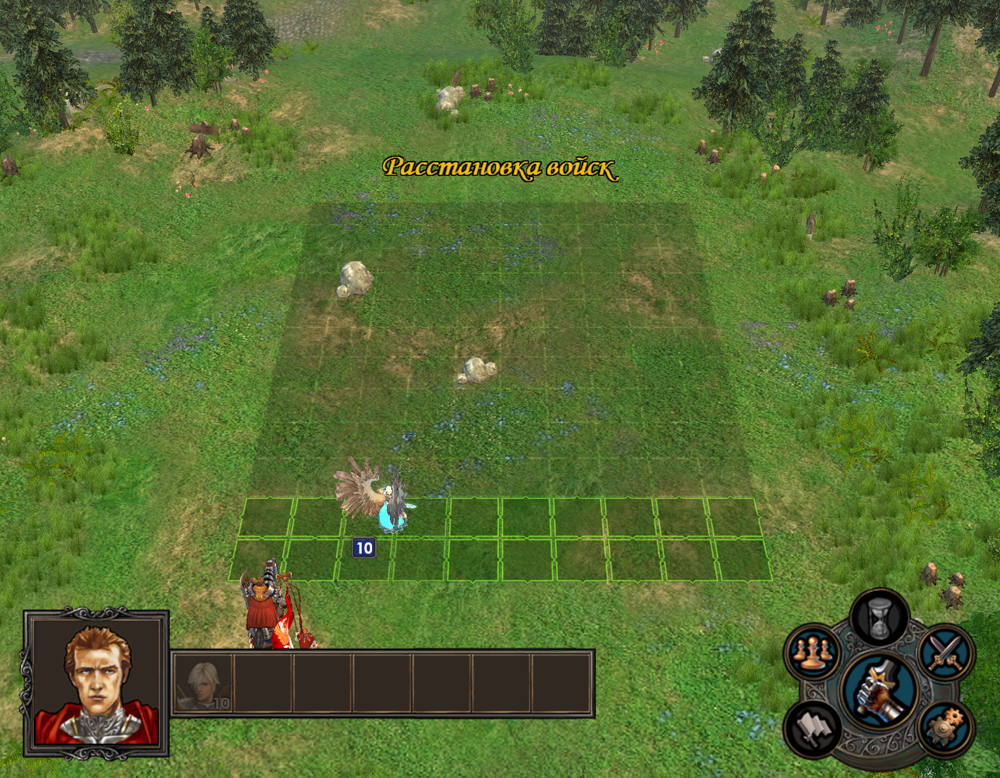](../assets/placement/academy-before.png)

*До подтверждения: видно поле и армию героя. Отсутствие моделей нейтралов не означает, что для алгоритма их армии нет.*

[](../assets/placement/academy-after.png)

*После подтверждения на том же поле видны три отряда. Появление моделей на экране и вычисление клеток — разные события; момент расчёта проверяется по вызовам игры, а не по видимости фигур.*

## 2. Затем выбирается способ построения

У игры есть простой и расширенный пути автопостроения. Выбор зависит от настройки `combat_active_auto_placement` и условия исходной армии. Для исследованного обычного нейтрала это условие связано с числом непустых записей армии объекта карты — не с числом разных картинок существ. Момент изменения этой армии модом требует отдельной проверки. [S2](#evidence).

Расширенный путь готовит признаки защитного и разреженного построения. В оценках участвуют стрелковые силы, крупные противники и площадные атаки; существуют дополнительные условия. Поэтому нельзя надёжно выбирать построение по одному признаку «у врага есть стрелок».

Дальнейшие этапы описывают в основном расширенный путь. Простой путь распределяет отряды по высоте и имеет собственные запасные попытки.

## 3. Проверяется место для всей фигуры

Малое существо занимает клетку **1×1**, крупное — квадрат **2×2**. Для крупного недостаточно найти одну свободную клетку: свободны должны быть все четыре. Камень или уже поставленный отряд могут исключить сразу несколько возможных положений большого существа.

Например, препятствие в `(2,2)` делает недопустимыми четыре якоря квадрата 2×2: `(2,2)`, `(3,2)`, `(2,3)`, `(3,3)`. Здесь якорь `(x,y)` обозначает квадрат из клеток `(x,y)`, `(x−1,y)`, `(x,y−1)`, `(x−1,y−1)`. Этот пример проверен исполнением участка обработки маски. [S3](#evidence).

[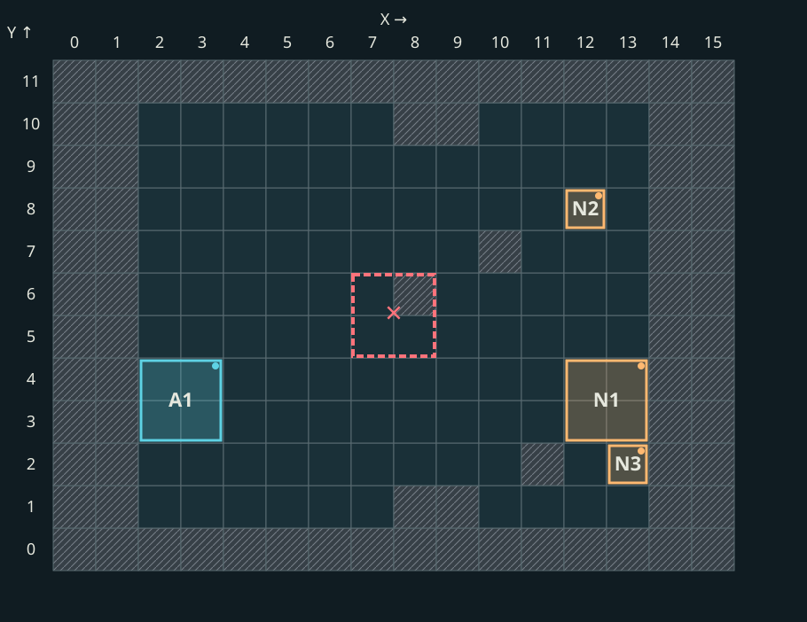](../assets/placement/pack_8-footprint.svg)

*Красный пунктир — только учебная попытка поставить квадрат с якорем `(8,6)`. Клетка `(8,6)` заблокирована в записанной маске, поэтому кандидат не подходит. Голубые и оранжевые фигуры — реальные начальные позиции обеих армий, они не перемещены ради рисунка.*

Игра также рассчитывает **глубину зоны расстановки**, то есть количество доступных начальных колонок. Само поле от этого не увеличивается. Учитываются свободное место, малые и крупные отряды; минимальная глубина связана с преимуществом «Тактики». В проверенном запуске Universe дополнительно менял расчёт вместимости крупных отрядов и добавлял колонку при четырёх и более крупных отрядах. Это наблюдение конкретной сборки, не правило всех версий Heroes V.

## 4. Ряды получают приоритет

Для ряда измеряется непрерывный свободный подход от установленной алгоритмом колонки до препятствия или границы. Для крупного существа учитываются соседние ряды: узкий проход в одном из них ограничивает весь квадрат.

Для стрелков есть выбор циклического окна рядов с минимальной суммой длин подходов. Длина окна связана с числом отрядов стрелковой категории. При равной сумме сохраняется первое найденное окно. Это геометрическая оценка, а не полная симуляция того, как враг будет идти и стрелять. [S4](#evidence).

[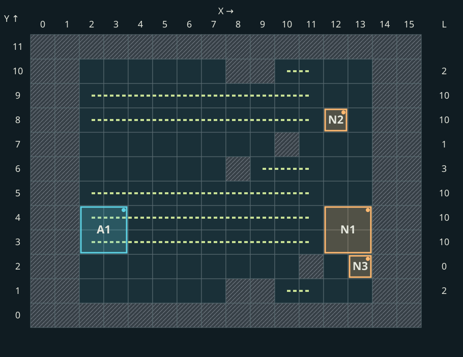](../assets/placement/pack_8-approach.svg)

*Пунктир и столбец L показывают отдельный геометрический расчёт: от X=11 идём к X=2 до первой заблокированной клетки. В ряду Y=2 сразу препятствие — L=0; в Y=1 свободны X=11 и X=10 — L=2. Фигуры армий сохранены для ориентира; линии используют статическую маску до Start и не моделируют ход существа. Это иллюстрация длины подхода, не трассировка всех внутренних решений конкретного боя.*

**Равные оценки не означают порядок сверху вниз.** В проверенной сортировке десять равных рядов обходятся как `8, 4, 6, 10, 2, 7, 3, 5, 9, 1` в координатах поля. Это порядок кандидатов при равенстве, а не готовое расположение десяти отрядов. Препятствия, занятость и выбор ветки ещё могут изменить результат.

## 5. Группы размещаются по очереди

В общем проходе расширенного алгоритма порядок категорий такой: [S5](#evidence).

| Очередь | Какие отряды обрабатываются | Зачем это различать |
|---|---|---|
| 1 | Крупные нестрелки без ауры сопротивления магии | Для них требуется свободный квадрат 2×2 |
| 2 | Стрелковая категория | Использует подготовленные ряды стрелков; есть исключение для метателей с подходящими гоблинами |
| 3 | Связанные группы гоблинов и использующих их существ | У них отдельный поиск соседних клеток |
| 4 | Существа с аурой сопротивления магии или прикрытием щитом | Имеют отдельную попытку размещения |
| 5 | Обычные малые нестрелки | Заполняют подходящие оставшиеся места |

Это порядок вызовов категорий, не универсальная сортировка всех существ и не порядок ходов. Перед общим проходом может выполняться защитный проход; далее идут попытки разместить оставшихся.

Внутри групп применяется оценка силы отряда. Она учитывает количество, урон, атаку, защиту и здоровье, а не просто уровень существа. В одной из специальных сортировок нелетающие идут перед летающими, затем при выполнении условия сравнивается скорость и только затем оценка. Нельзя заменить весь механизм сортировкой по инициативе или по порядку портретов.

Поддержку тоже нельзя описывать как «обязательно встанет рядом со стрелком». В исследованной функции есть проблема с использованием мировых координат в локальной проверке; попытка может не дать кандидатов. Это зафиксированное ограничение конкретного кода, а не основание дорисовывать желаемое соседство.

## 6. Если подходящие клетки закончились

Успешное размещение резервирует занимаемые клетки. Следующие отряды уже не могут использовать их повторно.

Если разместились не все, расширенный алгоритм может сдвинуть окно рядов и повторить построение. Есть дополнительные проходы по колонкам. В проверенном коде ветка, выглядящая как объединение одинаковых типов, не выполняет внутренний цикл для корректного размера вектора. Поэтому утверждение «игра обязательно объединит отряды при нехватке места» было бы неверным. Исключение записи из очередной попытки также само по себе не доказывает исчезновение существ из армии. [S6](#evidence).

## Практика: почему элементали заняли именно эти клетки

Разберём **четыре отряда по 15 элементалей** против армии героя. Здесь у нас есть не только итоговые координаты: записаны выбранный режим и последовательность попыток размещения самой игры.

[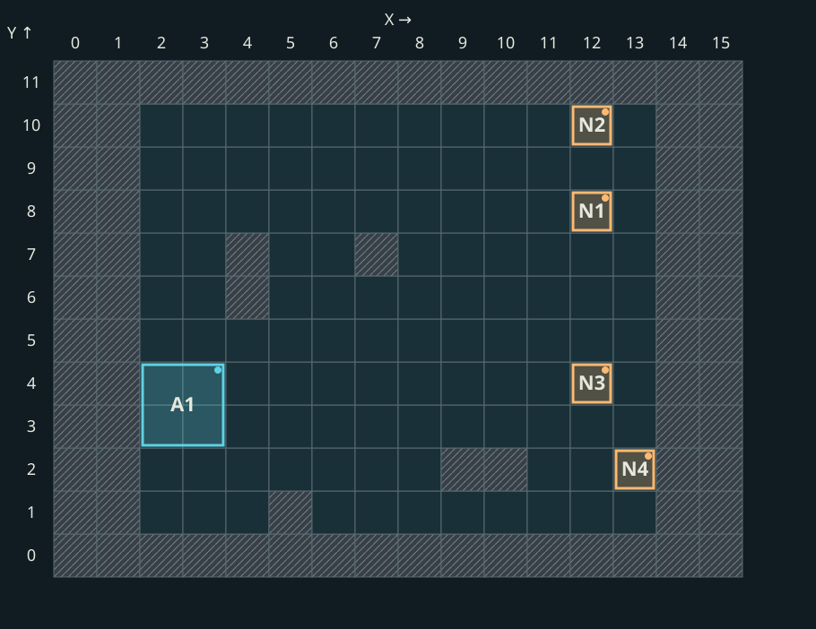](../assets/placement/elementals_trace-positions.svg)

На схеме этого опыта: **A1 — ангелы героя; N1 — земля, N2 — воздух, N3 — вода, N4 — огонь**. Нумерация отрядов относится к конкретному примеру.

### Входные условия

| Параметр | Значение | Что это означает для расчёта |
|---|---|---|
| Сетка | 16×12 со служебной рамкой | Игровые клетки в этом примере: X=2…13, Y=1…10 |
| Глубина расстановки | 2 колонки | Для показанного прохода стрелок начинает с X=13, малые нестрелки — с X=12 |
| Защитный режим | Выключен | Дополнительный защитный проход не выполняется |
| Разрежение | Выключено | Порядок рядов не фильтруется правилом разнесения |
| Стрелковых отрядов | 1 | Окно стрелка состоит из одного ряда |

Это записанные параметры данного боя. Мы не выводим их задним числом из картинки.

### Шаг 1. Считаем свободный подход для каждого ряда

От X=11 идём влево до первого препятствия или границы. На этом поле в ряду Y=2 свободна только X=11, а X=10 уже заблокирована. Значит, длина подхода равна **1**.

[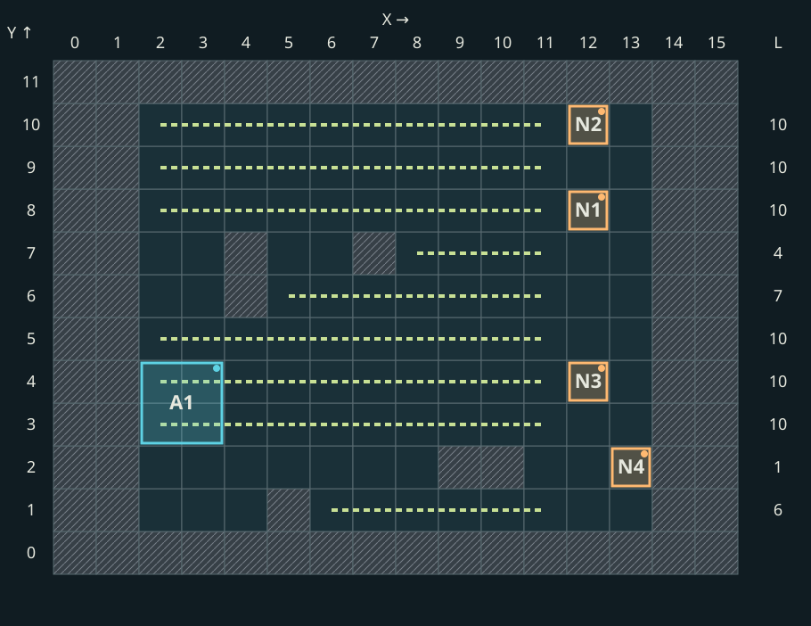](../assets/placement/elementals_trace-approach.svg)

| Ряд Y | 1 | 2 | 3 | 4 | 5 | 6 | 7 | 8 | 9 | 10 |
|---|---:|---:|---:|---:|---:|---:|---:|---:|---:|---:|
| Длина L | 6 | **1** | 10 | 10 | 10 | 7 | 4 | 10 | 10 | 10 |

Для одного стрелка минимальное окно — просто ряд с минимальным L. Здесь это **Y=2**. После сортировки нестрелковые ряды идут в порядке **8, 4, 10, 3, 5, 9, 6, 1, 7, 2**. Несколько рядов имеют L=10; первым становится восьмой из-за правила равенства в игровой сортировке, а не потому, что он выше остальных на картинке.

### Шаг 2. Огненный элементаль получает (13,2)

Огненный — единственный стрелок этой группы, поэтому обрабатывается раньше трёх малых нестрелков. Первая попытка: X=13, выбранный ряд Y=2. Клетка свободна — размещение успешно.

[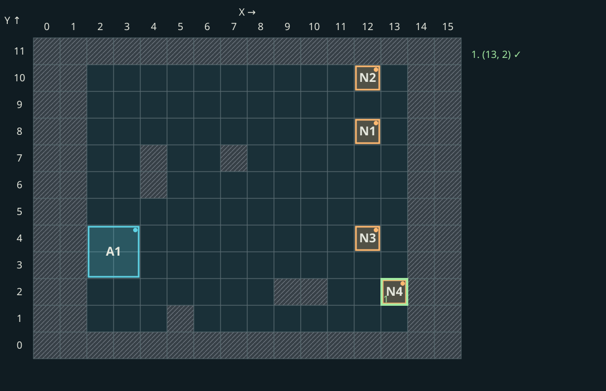](../assets/placement/elementals_trace-fire.svg)

**Почему именно здесь:** стрелковая роль задаёт колонку данного прохода, минимум L задаёт первый ряд, проверка занятости разрешает клетку.

### Шаг 3. Земляной элементаль получает (12,8)

У остальных трёх отрядов сначала сравнивается полёт. Земляной и водный не летают, воздушный летает и идёт после них. Для двух наземных скорость 4/5 не достигает порога этого сравнения: `16 − 2 − 6 = 8`, поэтому их порядок определяется оценкой силы.

Контрольный расчёт по определениям существ для 15 существ даёт земле 2034, воде 1269; земля идёт раньше. Это результаты отдельной проверки формулы, а не прочитанные в этом бою значения оценки. Записанная последовательность размещения подтверждает сам порядок: **земля → вода → воздух**.

Первый ряд списка — Y=8. Клетка `(12,8)` свободна, поэтому земляной встаёт туда.

[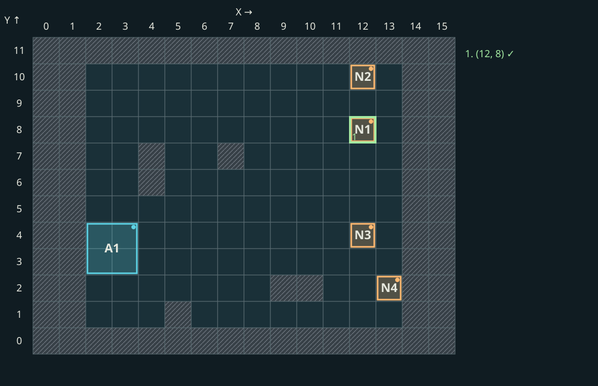](../assets/placement/elementals_trace-earth.svg)

### Шаг 4. Водный пропускает занятую клетку

Водный начинает с того же списка рядов, а не получает следующий ряд автоматически.

1. `(12,8)` — уже занят земляным: **отказ**.
2. `(12,4)` — свободен: **успех**.

[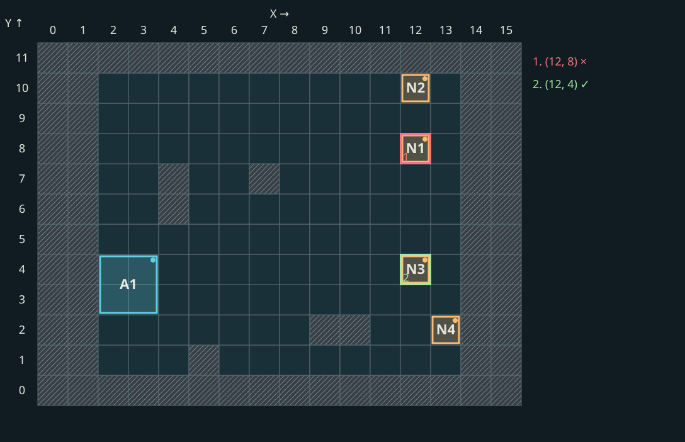](../assets/placement/elementals_trace-water.svg)

На схемах попыток показано итоговое поле. Красная рамка обозначает отвергнутого кандидата, зелёная — принятого. Это перебор мест расстановки, не движение существа по полю.

### Шаг 5. Воздушный пропускает две занятые клетки

1. `(12,8)` — земляной: **отказ**.
2. `(12,4)` — водный: **отказ**.
3. `(12,10)` — свободен: **успех**.

[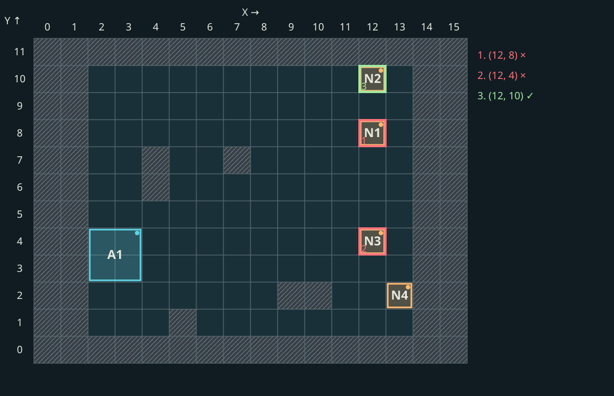](../assets/placement/elementals_trace-air.svg)

Высокая скорость воздушного не делает его первым в этой расстановке: проверка полёта стоит раньше сравнения скорости. И это по-прежнему порядок размещения, а не порядок ходов.

### Сверяем расчёт с действиями игры

| Отряд | Рассчитанные попытки | Запись игры |
|---|---|---|
| Огонь | `(13,2)` ✓ | Совпадает |
| Земля | `(12,8)` ✓ | Совпадает |
| Вода | `(12,8)` × → `(12,4)` ✓ | Совпадает |
| Воздух | `(12,8)` × → `(12,4)` × → `(12,10)` ✓ | Совпадает |

Совпали **все семь попыток**, включая три отказа, и **все четыре итоговые клетки**. Это подтверждает восстановленный проход на данных этого боя. Его [входы и игровая последовательность](../assets/placement/observations.json) опубликованы как запись `elementals_trace`.

## Код разобранного прохода

Ниже — краткий псевдокод. Это наш восстановленный алгоритм показанного прохода, не опубликованный исходник Nival и не реализация всех веток игры.

```text
lengths = measure_free_approaches(grid)
shooter_row = first_row_with_minimum(lengths)
melee_rows = native_sort_descending(lengths)

place(shooter, x=13, rows=[shooter_row, ...])
for stack in order_by_flight_and_score(melee_stacks):
    for row in melee_rows:
        candidate = (12, row)
        if whole_footprint_is_free(candidate, stack.size):
            place(stack, candidate)
            reserve_footprint(candidate, stack.size)
            break
```

Ключевые детали: сортировка сохраняет **игровое правило равенства**, каждый отряд проверяет список с начала, успешная установка сразу занимает клетки для следующих отрядов.

[Скачать исполняемый разбор на Python](../assets/placement/placement_walkthrough.py) и [его входные данные](../assets/placement/observations.json). Сохрани оба файла в одну папку и запусти:

```sh
python placement_walkthrough.py
```

Скрипт рассчитывает позиции из маски и характеристик примера; записанные итоговые клетки используются только для последующей сверки. Оценки силы в скрипте вычисляются из характеристик четырёх существ, а не задаются готовым порядком. Для `elementals_trace` используются записанные режимы и проверяется весь журнал попыток. Для второго поля режим задаётся явно как предположение; вывод помечается `context_source: assumed`. Без записанного режима или явного предположения скрипт останавливается. Защитные/разреженные режимы, другие составы и запасные ветки этим примером не реализованы.

## Другое поле: что даст тот же проход

Возьмём запись другого боя с тем же составом. Его режим не снимался, поэтому здесь **условно применяем тот же обычный проход** и сравниваем результат с сохранёнными клетками. В ряду Y=2 подход свободен на 10 клеток, а в Y=3 преграда оставляет только одну. В этом расчёте минимум перемещается **с ряда 2 в ряд 3** — для огненного получается `(13,3)`.

[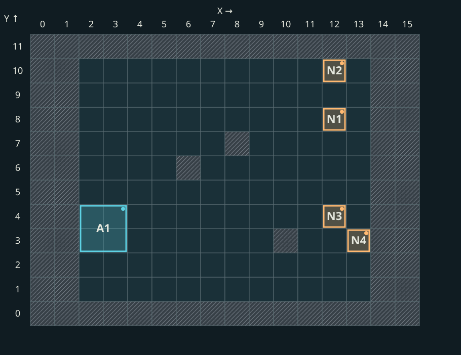](../assets/placement/pack_12-positions.svg)

У нестрелков первые три подходящих ряда остались **8, 4, 10**. Расчёт даёт земле `(12,8)`, воде `(12,4)`, воздуху `(12,10)` — все четыре позиции совпали с записью Start этого боя. Совпадение клеток не устанавливает, какую ветку выбрала игра в этом втором бою.

[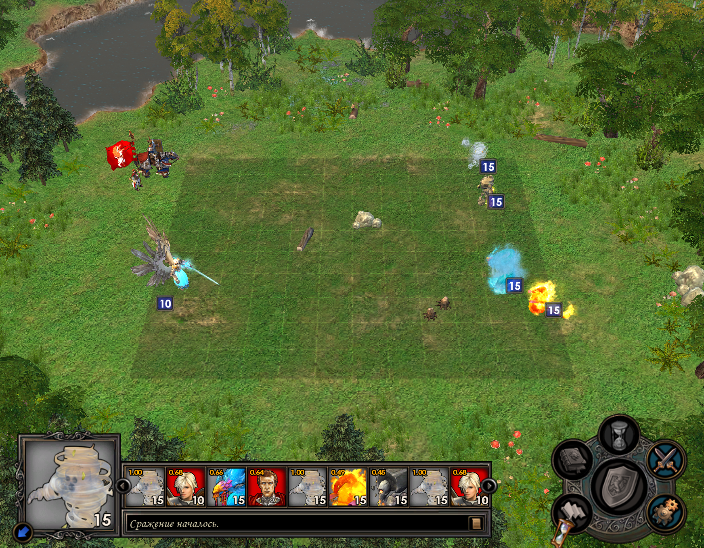](../assets/placement/pack_12.png)

*Огонь стоит в `(13,3)`, земля, вода и воздух — в рядах 8, 4 и 10. Эти клетки совпали с условным расчётом; причины здесь не подтверждены внутренним журналом.*

## Крупный отряд: проверяем весь квадрат

В смешанной армии пещерный демон N4 занимает якорь `(13,4)`, то есть клетки `(12,3)`, `(13,3)`, `(12,4)`, `(13,4)`. Ангелы A1 на другой стороне тоже занимают квадрат 2×2.

[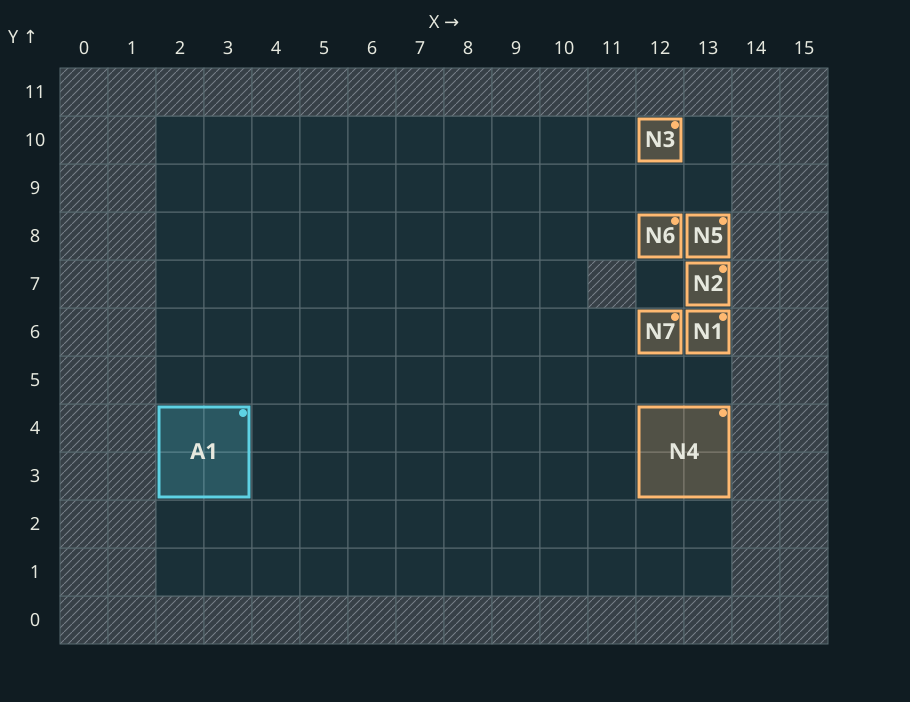](../assets/placement/pack_15-positions.svg)

[](../assets/placement/pack_15.png)

*Сравни большой квадрат N4 с соседними клетками N1/N2/N5. Проверять только точку `(13,4)` недостаточно: все четыре клетки должны быть свободны.*

Этот пример иллюстрирует проверку площади. Причины выбора всех семи позиций здесь не восстановлены по журналу попыток; подробным подтверждением последовательности выше служит бой элементалей.

## Что можно заключить до боя

- Размеры и роли существ помогают понять требования к месту, но не задают единственную универсальную схему.
- Препятствия влияют и на допустимые клетки, и на порядок рассмотрения рядов.
- Неизвестные разделение, улучшения, количества и выбор ветки оставляют неопределённость. Скриншот поля сам по себе не содержит всех входов игры.
- Переносить пример на другую арену или сборку без проверки нельзя. Для осад, специальных боёв и других модификаций эта статья не устанавливает тождество алгоритмов.

## На чём основан разбор {#evidence}

Дата опытов: **2026-09-23**, тестовая карта `WorkshopPolygon`. Это собственное исследование исполняемого файла и наблюдения, не официальное описание Nival. Сводка подготовлена по исследованию 21–22 сентября с учётом поздних исправлений.

SHA-256 исследованного `H5_Game.exe`: `88c9dc6107b9bced0649924a86360f1c56397ee00de0413f6f2b08f865ed5519`. Совпадение EXE не гарантирует одинаковые модификации DLL и ресурсов; примеры относятся к использованной установке Universe.

| Метка | Что проверялось | Способ и граница вывода |
|---|---|---|
| S1 | Подготовка и разделение: `0x855240`; поля CombatSize/Upgrades | Чтение кода и XML-загрузчика; исполнение участка выбора количества. Не полный тест вероятностей всех нейтралов |
| S2 | Выбор пути: `0x85a190`; стратегия: `0xa30730` | Разбор вызовов и связи с исходной армией; не все условия стратегии подтверждены живыми боями |
| S3 | Квадрат 2×2: `0xb3efb0`; глубина: `0x85a2a0`; Тактика: `0x4d8c10` | Исполнение участков маски/подсчёта, статическая цепочка Тактики; изменения глубины Universe наблюдались в отдельном запуске 22 сентября |
| S4 | Ряды: `0x857b60`, `0x857e60`; сортировка: `0x85a700` | Инструкции и контроль сортировки, включая равные ключи; не доказательство одной схемы для всех полей |
| S5 | Общий проход: `0x859670`; оценка: `0xbf9b80`; поддержка: `0x8580e0` | Чтение кода и проверки отдельных участков; исключения соседства нельзя заменять предполагаемым поведением |
| S6 | Повторные попытки: `0x859eb0`; объединение: `0x8599d0` | У внутреннего цикла объединения подтверждена недостижимость в проверенном EXE; это не утверждение обо всех модифицированных версиях |

Числовой контроль оценки использует определения `Neutrals/*_Elemental.xdb` из `Universe_mod.pak`, количество 15, коэффициенты 0.05/0.05, опорную атаку 1 и нулевой защитный параметр эталона. Последний ноль соответствует разобранному полю агрегата; это не обычная защита крестьянина. Получены оценки: земля 2034, вода 1269, огонь 940, воздух 733. Этот контроль не включает модификаторы героя и не является формулой наносимого боевого урона.

Для независимой проверки координат на собственной тестовой карте можно записать их в боевом callback `Start` **до первого хода**:

[Код записи обеих армий и привязка CombatScript](../modding/combat-scripts.md).


Метод записи:

- Координаты обеих армий получены в боевом `Start`; это не запрос из консоли приключений. Предиктор не загружался, наблюдатель клетки не назначал.
- Маска препятствий снята до Start. Для опыта элементалей режим записан перед общим проходом, а кандидаты — на входе и выходе функции размещения.
- Записанные конечные клетки не использовались как вход восстановления.

[Данные опытов и хеши исходных снимков](../assets/placement/observations.json) · [Дневник с последовательностью попыток](../reference/research-diary.md#elementals) · [Скачать полигон](../modding/test-maps.md).

Карта позволяет повторить нападения, но не фиксирует героя, настройки, случайное состояние и маску арены каждого архивного опыта. Совпадение всех клеток со снимками не гарантируется.
