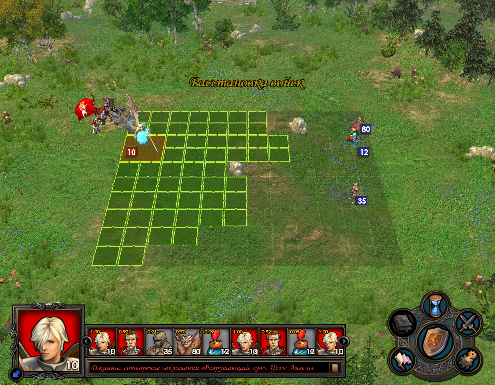
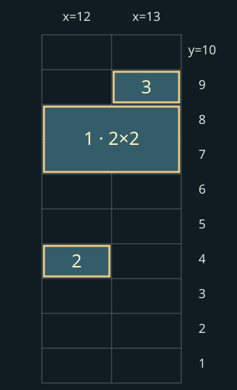
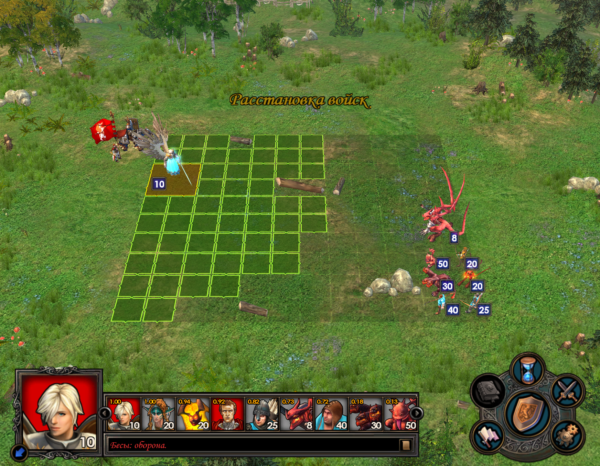

# Как игра расставляет нейтральную армию

Игра сначала готовит **боевые отряды**, затем выбирает способ построения, определяет доступные клетки и размещает группы существ по очереди. Поэтому состав армии, препятствия, размер существ и выбранная ветка алгоритма могут менять стартовые позиции. Одного правила «стрелки сзади, остальные впереди» недостаточно.

Разбор относится к исследованной сборке **Heroes V: Повелители Орды с Universe**. Он объединяет чтение кода игры, проверки отдельных участков и два наблюдения на тестовой карте. Это не полная спецификация всех режимов: границы подтверждения указаны [в конце статьи](#evidence). Здесь объясняется игра, а не алгоритм стороннего предиктора.

## 1. Сначала определяется, сколько будет отрядов

Армия объекта на карте и набор отрядов в бою — разные этапы подготовки.

В исследованной функции подготовки для двух и более исходных записей копируются типы и количества. Для одной записи есть отдельная ветка разделения: она выбирает начальное число отрядов по отношению оценок силы, затем вносит случайную поправку и ограничивает результат количеством существ. Это описание конкретной ветки; изменения состава раньше неё и другие режимы боя отдельно не исключены. [Точки проверки S1](#evidence).

После выбора числа отрядов количество распределяется с остатком. **Если 10 существ уже решено разделить на три отряда**, получаются **4 + 3 + 3**: каждому по три, оставшееся существо — первому. Это пример распределения, а не обещание, что десять существ всегда делятся на три части.

В этой же ветке при определённых условиях внутренние отряды могут получить тип из списка улучшений исходного существа. Крайние сохраняют исходный тип. Поэтому разделение, выбор улучшения и выбор клетки нельзя считать одной операцией. Точные вероятности здесь не приводятся: границы проверок кода известны, но распределение генератора случайных чисел отдельно не подтверждено.

## 2. Затем выбирается способ построения

У игры есть простой и расширенный пути автопостроения. Выбор зависит от настройки `combat_active_auto_placement` и условия исходной армии. Для исследованного обычного нейтрала это условие связано с числом непустых записей армии объекта карты — не с числом разных картинок существ. Момент изменения этой армии модом требует отдельной проверки. [S2](#evidence).

Расширенный путь готовит признаки защитного и разреженного построения. В оценках участвуют стрелковые силы, крупные противники и площадные атаки; существуют дополнительные условия. Поэтому нельзя надёжно выбирать построение по одному признаку «у врага есть стрелок».

Дальнейшие этапы описывают в основном расширенный путь. Простой путь распределяет отряды по высоте и имеет собственные запасные попытки.

## 3. Проверяется место для всей фигуры

Малое существо занимает клетку **1×1**, крупное — квадрат **2×2**. Для крупного недостаточно найти одну свободную клетку: свободны должны быть все четыре. Камень или уже поставленный отряд могут исключить сразу несколько возможных положений большого существа.

Например, препятствие в `(2,2)` делает недопустимыми четыре якоря квадрата 2×2: `(2,2)`, `(3,2)`, `(2,3)`, `(3,3)`. Здесь якорь `(x,y)` обозначает квадрат из клеток `(x,y)`, `(x−1,y)`, `(x,y−1)`, `(x−1,y−1)`. Этот пример проверен исполнением участка обработки маски. [S3](#evidence).

Игра также рассчитывает **глубину зоны расстановки**, то есть количество доступных начальных колонок. Само поле от этого не увеличивается. Учитываются свободное место, малые и крупные отряды; минимальная глубина связана с преимуществом «Тактики». В проверенном запуске Universe дополнительно менял расчёт вместимости крупных отрядов и добавлял колонку при четырёх и более крупных отрядах. Это наблюдение конкретной сборки, не правило всех версий Heroes V.

## 4. Ряды получают приоритет

Для ряда измеряется непрерывный свободный подход от установленной алгоритмом колонки до препятствия или границы. Для крупного существа учитываются соседние ряды: узкий проход в одном из них ограничивает весь квадрат.

Для стрелков есть выбор циклического окна рядов с минимальной суммой длин подходов. Длина окна связана с числом отрядов стрелковой категории. При равной сумме сохраняется первое найденное окно. Это геометрическая оценка, а не полная симуляция того, как враг будет идти и стрелять. [S4](#evidence).

**Равные оценки не означают порядок сверху вниз.** В проверенной сортировке десять равных рядов обходятся как `8, 4, 6, 10, 2, 7, 3, 5, 9, 1` в координатах поля. Это порядок кандидатов при равенстве, а не готовое расположение десяти отрядов. Препятствия, занятость и выбор ветки ещё могут изменить результат.

## 5. Группы размещаются по очереди

В общем проходе расширенного алгоритма порядок категорий такой: [S5](#evidence).

| Очередь | Какие отряды обрабатываются | Зачем это различать |
|---|---|---|
| 1 | Крупные нестрелки без ауры сопротивления магии | Для них требуется свободный квадрат 2×2 |
| 2 | Стрелковая категория | Использует подготовленные ряды стрелков; есть исключение для метателей с подходящими гоблинами |
| 3 | Связанные группы гоблинов и использующих их существ | У них отдельный поиск соседних клеток |
| 4 | Существа с аурой сопротивления магии или прикрытием щитом | Имеют отдельную попытку размещения |
| 5 | Обычные малые нестрелки | Заполняют подходящие оставшиеся места |

Это порядок вызовов категорий, не универсальная сортировка всех существ и не порядок ходов. Перед общим проходом может выполняться защитный проход; далее идут попытки разместить оставшихся.

Внутри групп применяется оценка силы отряда. Она учитывает количество, урон, атаку, защиту и здоровье, а не просто уровень существа. В одной из специальных сортировок нелетающие идут перед летающими, затем при выполнении условия сравнивается скорость и только затем оценка. Нельзя заменить весь механизм сортировкой по инициативе или по порядку портретов.

Поддержку тоже нельзя описывать как «обязательно встанет рядом со стрелком». В исследованной функции есть проблема с использованием мировых координат в локальной проверке; попытка может не дать кандидатов. Это зафиксированное ограничение конкретного кода, а не основание дорисовывать желаемое соседство.

## 6. Если подходящие клетки закончились

Успешное размещение резервирует занимаемые клетки. Следующие отряды уже не могут использовать их повторно.

Если разместились не все, расширенный алгоритм может сдвинуть окно рядов и повторить построение. Есть дополнительные проходы по колонкам. В проверенном коде ветка, выглядящая как объединение одинаковых типов, не выполняет внутренний цикл для корректного размера вектора. Поэтому утверждение «игра обязательно объединит отряды при нехватке места» было бы неверным. Исключение записи из очередной попытки также само по себе не доказывает исчезновение существ из армии. [S6](#evidence).

## Пример: три отряда Академии

[](../assets/placement/pack_8.png)

*Реальный кадр начала боя, DLL предиктора не загружена. Джинны уже применили заклинание; это не снимок строго в момент события Start. Таблица ниже получена отдельно из Start до ходов. Изображение можно открыть в полном размере.*

| Отряд | Стартовый якорь `(x,y)` | Занимаемые клетки |
|---|---|---|
| Джинны | `(13,8)` | `(12,7)`, `(13,7)`, `(12,8)`, `(13,8)` |
| Железные големы | `(12,4)` | Одна клетка |
| Гремлины | `(13,9)` | Одна клетка |

{ width="340" }

*Схема по записи Start, не ракурс игровой камеры: 1 — джинны, 2 — големы, 3 — гремлины. Показаны только колонки 12–13; препятствия и остальное поле здесь не нарисованы.*

Здесь видны разные роли и размеры: джиннам нужно четыре клетки, стрелкам-гремлинам — одна, големам — другое свободное место. Сам кадр не доказывает, какая ветка выбрана и почему каждому ряду присвоена конкретная оценка: для этого нужен разбор кода выше. [Запись опыта](../assets/placement/observations.json).

## Пример: семь отрядов

[](../assets/placement/pack_15.png)

*Второй бой на том же полигоне, с другой геометрией препятствий. Предиктор отключён. Кадр сделан в начале боя; таблица — отдельная запись стартовых координат.*

| Идентификатор типа в игре | Стартовый якорь |
|---|---|
| `CREATURE_GRAND_ELF` | `(13,3)` |
| `CREATURE_ARCHER` | `(13,1)` |
| `CREATURE_PEASANT` | `(12,1)` |
| `CREATURE_PIT_FIEND` — размер 2×2 | `(13,5)` |
| `CREATURE_INFERNAL_SUCCUBUS` | `(13,2)` |
| `CREATURE_CERBERI` | `(12,2)` |
| `CREATURE_FAMILIAR` | `(12,3)` |

Идентификаторы оставлены для точного сопоставления с [записью опыта](../assets/placement/observations.json), независимо от перевода названий. Якорь большого демона `(13,5)` занимает также `(12,4)`, `(13,4)`, `(12,5)`; маленькие отряды рядом не пересекают его квадрат. Армия не обязана равномерно заполнять всю высоту поля.

Эти два боя отличаются и составом, и препятствиями. Сравнение показывает два возможных результата игры, но не изолирует влияние только одного фактора.

## Что можно заключить до боя

- Размеры и роли существ помогают понять требования к месту, но не задают единственную универсальную схему.
- Препятствия влияют и на допустимые клетки, и на порядок рассмотрения рядов.
- Неизвестные разделение, улучшения, количества и выбор ветки оставляют неопределённость. Скриншот поля сам по себе не содержит всех входов игры.
- Переносить пример на другую арену или сборку без проверки нельзя. Для осад, специальных боёв и других модификаций эта статья не устанавливает тождество алгоритмов.

## На чём основан разбор {#evidence}

Дата опытов: **2026-09-23**, тестовая карта `WorkshopPolygon`. Это собственное исследование исполняемого файла и наблюдения, не официальное описание Nival. Сводка подготовлена по исследованию 21–22 сентября с учётом поздних исправлений.

SHA-256 исследованного `H5_Game.exe`: `88c9dc6107b9bced0649924a86360f1c56397ee00de0413f6f2b08f865ed5519`. Совпадение EXE не гарантирует одинаковые модификации DLL и ресурсов; примеры относятся к использованной установке Universe.

| Метка | Что проверялось | Способ и граница вывода |
|---|---|---|
| S1 | Подготовка и разделение: `0x855240`; поля CombatSize/Upgrades | Чтение кода и XML-загрузчика; исполнение участка выбора количества. Не полный тест вероятностей всех нейтралов |
| S2 | Выбор пути: `0x85a190`; стратегия: `0xa30730` | Разбор вызовов и связи с исходной армией; не все условия стратегии подтверждены живыми боями |
| S3 | Квадрат 2×2: `0xb3efb0`; глубина: `0x85a2a0`; Тактика: `0x4d8c10` | Исполнение участков маски/подсчёта, статическая цепочка Тактики; изменения глубины Universe наблюдались в отдельном запуске 22 сентября |
| S4 | Ряды: `0x857b60`, `0x857e60`; сортировка: `0x85a700` | Инструкции и контроль сортировки, включая равные ключи; не доказательство одной схемы для всех полей |
| S5 | Общий проход: `0x859670`; оценка: `0xbf9b80`; поддержка: `0x8580e0` | Чтение кода и проверки отдельных участков; исключения соседства нельзя заменять предполагаемым поведением |
| S6 | Повторные попытки: `0x859eb0`; объединение: `0x8599d0` | У внутреннего цикла объединения подтверждена недостижимость в проверенном EXE; это не утверждение обо всех модифицированных версиях |

Для независимой проверки координат на собственной тестовой карте можно записать их в боевом callback `Start` **до первого хода**:

```lua
function Start()
    for index, unit in GetDefenderCreatures() do
        local x, y = GetUnitPosition(unit);
        print("PLACEMENT", unit, GetCreatureType(unit), x, y);
    end;
end;
```

Это код боевого скрипта карты, не команда для обычной консоли приключений. В опытах использованы такой обход защитников и отдельный наблюдатель результата `GetUnitPosition`. Предиктор не загружался; наблюдатель не назначает клетки. Подготовленная [публичная запись двух боёв](../assets/placement/observations.json) содержит координаты и хеши неизменённых снимков. Полигон пока не опубликован, поэтому точное повторение именно этих арен читателем не обеспечено; собственная карта позволяет проверить метод записи, но не обязана дать те же клетки.
