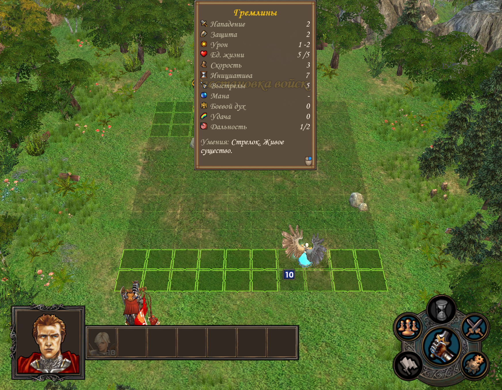
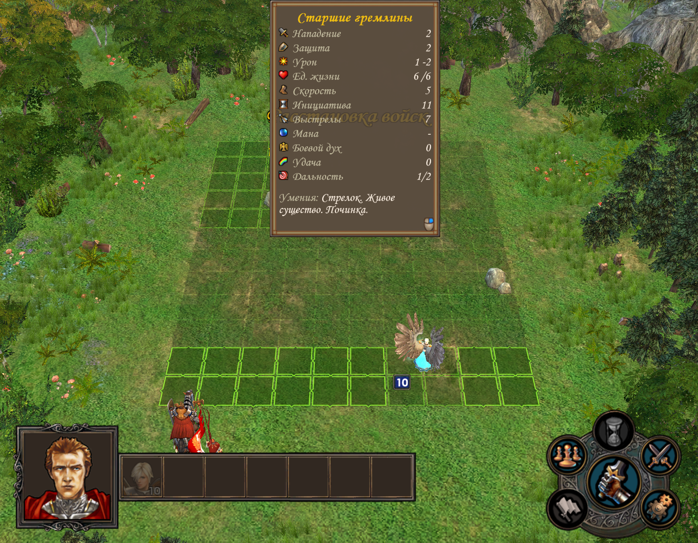

# Что показывает проекция расстановки

Экспериментальная проекция показывает **предполагаемое место известного типа существа**, а не раскрывает фактический скрытый стек. Если один тип разделится на несколько отрядов, число проекций и число противников после Start могут различаться.

## Как читать карточку

| Действие | Поведение проверенного прототипа |
|---|---|
| Навести на проекцию | Область хода для выбранного справочного типа |
| Первый ПКМ | Полная карточка базового либо уже известного типа |
| Повторные ПКМ при неизвестном грейде | База → улучшение → альтернативное улучшение → база |
| Двойной ЛКМ | Штатное подробное окно существа |
| Стрелки подробного окна | Переключение доступных справочных вариантов |
| Start | Проекции, их карточки и подсветка удаляются |

Удержание физического ПКМ отдельно не получило законченного подтверждения. Нижние дополнительные стрелки были экспериментом и удалены; не искать их в текущем варианте. У явно известного улучшенного типа нет основания изображать все грейды как одинаково вероятные.

## Статы берутся из определения выбранного типа

В этом контроле базовая скорость 3, у улучшенного варианта 5. Переключение меняет и карточку, и расчёт области хода: ключ кэша включает тип существа. Speed, Flying и CombatSize читаются из его [определения](../reference/creatures.md); название и поля карточки формирует штатный descriptor. Это не таблица статов, вручную зашитая под три показанных существа.

Справочный descriptor создаётся для одного существа без героя и реального боевого стека. Поэтому «1» в подробном окне не означает, что в охране один противник; эффекты реального боя этой справкой не подтверждаются.

## Почему это не точная копия всей игры

Прототип использует публичные типы и геометрию. Он не читает скрытую численность, конечные грейды и итоговую боевую армию. Базовое предположение — один отряд на публичный тип; специальные стратегии, разделение и изменения состава могут дать другой результат.

В живом одиночном контроле одна проекция крестьянина перед Start соответствовала трём вышедшим отрядам по10. Это пример ограничения предположения, а не доказательство ошибки размеров клетки. Механизм **самой игры** разобран отдельно в [статье о расстановке](army-placement.md).

## Статус

Речь о прототипе, проверенном в нашей сборке 21–23 сентября, а не опубликованном совместимом со всеми установками релизе. Физическое открытие/переключение ПКМ подтверждалось пользователем; другие контроли включали адресные сообщения окна и не заменяют такую проверку. В текущем оформлении оставлены непрозрачные фигуры и слабое тёплое свечение.
